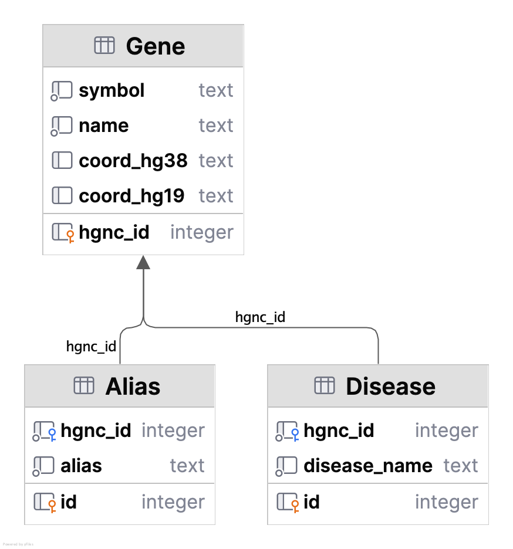

# Gene–Disease Association Extraction from a Research Article

## Summary

This project provides a pipeline to extract gene mentions and their associated diseases from a scientific publication and compile detailed gene metadata. It was inspired by the open-access article [**Diagnostic yield of exome and genome sequencing after non-diagnostic multi-gene panels in patients with single-system diseases**](https://pmc.ncbi.nlm.nih.gov/articles/PMC11127317/), The code retrieves gene symbols (with HGNC identifiers) mentioned in the article, identifies any disease connections in the text, fetches comprehensive gene metadata from external databases, and outputs the results in a structured format. In addition, the project defines a SQL database schema for this data and demonstrates example queries to retrieve gene–disease associations and gene aliases.

## Background and Motivation
Rare disease genomic studies often yield valuable insights into gene–disease relationships. The referenced article by Wilke et al. (2024) examined the diagnostic yield of whole exome/genome sequencing versus targeted gene panels in patients with certain single-system diseases. Several gene variants were highlighted in the study (e.g., APOL1, COL4A3, NPHS2, RRAGD, HNF1A, etc.), along with their relevance to specific conditions (kidney diseases, Alport syndrome, nephrotic syndrome, tubulopathies, diabetes, etc.). This project uses that article as a test case to:
- **Extract Gene Mentions**: Identify all gene symbols mentioned in the text (especially those annotated with HGNC IDs).
- **Link Genes to Diseases**: Detect disease terms in proximity to gene mentions to capture gene–disease associations described by the authors.
- **Retrieve Gene Metadata**: For each gene of interest, gather additional information (official name, aliases, genomic coordinates) from authoritative sources (HGNC, NCBI, Ensembl).
- **Store and Query Data**: Output the gathered information to a CSV and store it in a relational database, enabling structured queries such as listing each gene’s diseases and aliases.
  
## Script Explanation

### `main.py`
Coordinates the full pipeline. It accepts a PubMed ID or PMC ID, fetches the article text, extracts gene and disease mentions, enriches each gene with metadata (HGNC ID, aliases, genomic coordinates), and writes the results to a CSV.

### `article_retriever.py`
Downloads the body text of a publication using the Europe PMC API. Converts a given PMID or PMCID to the corresponding full-text XML, then parses and returns the main article body (excluding references, abstracts, etc.).

### `gene_extractor.py`
Uses regular expressions and context patterns to identify gene mentions. Recognizes both explicitly tagged genes (e.g., `COL4A3 (HGNC:2204)`) and contextual mentions (e.g., "HERC2"). Records gene symbols and mention positions.

### `gene_metadata.py`
Retrieves gene information via HGNC, Ensembl, and NCBI APIs. Gathers:
- HGNC ID and full name
- Aliases (from HGNC + NCBI Entrez)
- Genomic coordinates on hg38 and hg19 (from Ensembl)
- Nearby disease terms in the article using SciSpaCy’s disease NER

Combines all data into a structured record per gene.

**Usage:**

Run the script (no arguments needed, as the gene list is built-in):

    $  python main.py -i PMC11127317 -o output_gene_metadata.cs

This will fetch the gene data and create an output file `output_gene_metadata.csv` in the current directory.

## CSV Output Description

Part 1: The output CSV (`output_gene_metadata.csv`) contains the following columns for each gene:

- **HGNC ID** – The unique identifier assigned to the gene by the HUGO Gene Nomenclature Committee (e.g., *HGNC:618* for APOL1).
- **Gene Symbol** – The official gene symbol (short abbreviation, e.g., *APOL1*).
- **HGNC Gene Name** – The full name/description of the gene as recorded by HGNC (e.g., *apolipoprotein L1*).
- **Gene Aliases** – Alternative names or symbols that have been used for the gene (synonyms, previous names, or abbreviations).
- **hg38 Coordinates** – The gene’s location on the human genome (chromosome and start-end positions) based on the GRCh38/hg38 reference assembly.
- **hg19 Coordinates** – The gene’s location on the older GRCh37/hg19 assembly, which is provided for reference or compatibility with legacy data.
- **Disease** – Known disease(s) or conditions associated with mutations or variants in this gene. Multiple entries are separated by semicolons. (These associations were derived from clinical databases and the article’s context. For example, *APOL1* risk variants are known to contribute to kidney disease, *RRAGD* variants can cause a syndrome with dilated cardiomyopathy, tubulopathy, and hypomagnesemia, *COL4A3* is implicated in Alport syndrome and certain kidney lesions, etc.)

Users can open the CSV file to examine the detailed information. This structured data can be useful for researchers or clinicians looking into gene-disease relationships highlighted by the study.

## Database Schema
Part 2: Database Schema and Querying
With the gene metadata compiled, the next part of the project involves designing a relational database schema to store this information and running queries to answer specific questions.

1. Database Schema Design
The database (implemented here as a SQLite database genes.sqlite) is structured to normalize the gene information and facilitate querying of gene–disease and gene–alias relationships. The schema (defined in database_ddl.sql) consists of multiple tables:

Genes – core table containing unique genes (one per HGNC ID):
hgnc_id (PRIMARY KEY) – e.g., "HGNC:618"
symbol – gene symbol (e.g., APOL1)
name – full gene name (e.g., Apolipoprotein L1)
coord_hg38 – genomic coordinates on GRCh38 (chr:start-end)
coord_hg19 – genomic coordinates on GRCh37
(Gene symbols and names are also stored for reference; HGNC ID uniquely identifies each gene.)

Aliases – gene alias table (to capture one-to-many relationship of gene to alias names):
alias – an alias or previous name for the gene (e.g., "ApoL-I")
hgnc_id – reference to the gene (foreign key to Genes.hgnc_id)
(Each alias for a gene is a separate row. If a gene has multiple aliases, it will have multiple entries in this table.)

Diseases – disease reference table:
disease_name – name of a disease or condition (e.g., "Alport syndrome")
disease_id (PRIMARY KEY) – unique ID for the disease (could be an auto-increment integer or a natural key)

GeneDiseases – association table linking genes to diseases (many-to-many relationship):
hgnc_id – reference to a gene (foreign key to Genes)
disease_id – reference to a disease (foreign key to Diseases)
(Each row indicates that a gene is associated with a particular disease as mentioned in the article. A gene with multiple diseases will have multiple rows here, and a disease linked to multiple genes will also appear in multiple rows.)

2. Importing Data into the Database
The script csv_to_db.py (provided in the repository) reads the output_gene_metadata.csv from Part 1 and populates the SQLite database according to the schema. In brief, the import process:
Creates the tables defined in database_ddl.sql (if not already created).
Iterates through each row of the CSV:
Inserts the gene (hgnc_id, symbol, name, coords) into the Genes table.
Splits the aliases field by ; and inserts each alias (if non-empty) into Aliases with the corresponding hgnc_id.
Splits the disease field by ; and inserts each disease name (if not already present) into Diseases, then creates an entry in GeneDiseases linking the gene to that disease.
The result is a populated genes.sqlite database file.

3. Example Queries and Outputs
To demonstrate the usefulness of the database, we include two example SQL queries (in the sql_queries directory) and their outputs:
Query 1 – HGNC ID and Disease Connection: (sql_queries/hgnc_diseases.sql)
This query retrieves each gene’s HGNC ID alongside the disease(s) associated with that gene. It joins the Genes table with GeneDiseases and Diseases tables
Query 2 – Gene Name and Aliases: (sql_queries/hgnc_aliases.sql)
This query fetches each gene’s official name along with any alias names. It typically joins Genes and Aliases tables. The result (see hgnc_aliases_results.csv) shows lines like:

For integrators who wish to import this data into a database, a simple schema is proposed to normalize the information. The diagram below (see `dbschema.png`) illustrates one possible relational model:

This structure avoids redundancy by not repeating gene info for each alias or disease. The provided `dbschema.png` visualizes these tables and their relationships.

## Known Limitations

- **NER Coverage:** The named entity recognition model may miss some specific medical terms or acronyms. For example, the acronym MODY (which stands for Maturity Onset Diabetes of the Young
pmc.ncbi.nlm.nih.gov, a type of hereditary diabetes) was mentioned in the article but not recognized as a disease term by the model. As a result, a known association (HNF1A → MODY) did not appear in the output CSV. Future improvements could include custom dictionaries or better NER models to catch such cases.
- **Data Sources:** The metadata is dependent on external databases (e.g., HGNC, OMIM). If those sources update or if the APIs change, the script might need adjustments. Also, disease association data might not be exhaustive; the script captures major known associations, but some nuanced or newly discovered links could be missing.
- **Context and Specificity** The extraction links genes to diseases based on textual co-occurrence, which might not capture complex relationships perfectly. In the output, some disease entries are very general or include database identifiers (e.g., an OMIM number was extracted as if it were a disease name). These quirks reflect the limits of straightforward text parsing. A more advanced approach could use relation extraction models to ensure the gene–disease links are precise and filter out irrelevant terms.
- **Testing and Validation:** The script was tested on the specific genes from the study. Its robustness for a larger or different set of genes (especially if including those with very large numbers of aliases or complex data) hasn’t been extensively evaluated. Minor adjustments might be needed for edge cases.

## Installation Requirements

To run the script and reproduce the data extraction, you will need:

- **Python 3.8 or newer** – the pipeline was developed and tested on Python ≥ 3.8.  
- **Required Python libraries**  
  - `requests` – HTTP calls to external APIs (e.g., MyGene.info).  
  - `pandas` – data wrangling and CSV writing.  
  - *(Optional)* `json` – part of the Python standard library; used for parsing API responses.  
  - `spacy` **and** `scispacy` – biomedical NER (gene & disease recognition).  
    - Example model: `en_ner_bc5cdr_md` (Disease).  
    - Can incoperate more advanced models like hugging face BioBertRelationGenesDiseases in the future 
  - *(Optional)* `mygene` – light wrapper for the MyGene.info API; simplifies HGNC/Entrez look-ups compared with raw `requests` calls.

> **Tip:** All exact version pins are listed in `requirements.txt`; run  
> `pip install -r requirements.txt` to pull everything in one shot.

You can install the required libraries using pip 

Ensure your environment has internet access when running the script, as it needs to contact remote databases.

Users interested in the data or script can clone the repository and run the script to regenerate the CSV, or modify the script to adapt to similar projects or new gene lists.

